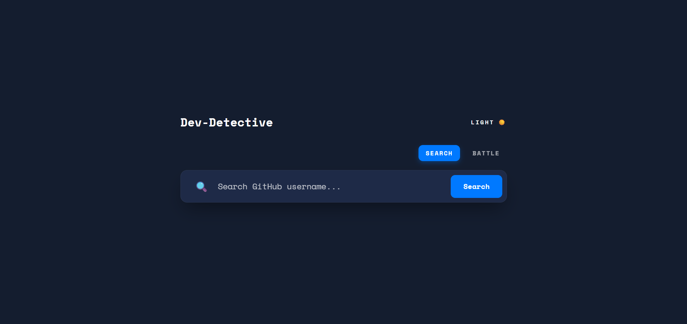
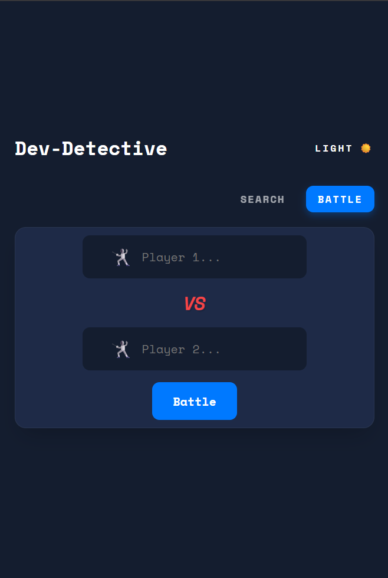

# Dev Detective – GitHub User Search App

A polished, responsive GitHub user search application that demonstrates interaction with external APIs, asynchronous JavaScript, and dynamic DOM manipulation.

---

## 📑 Table of Contents
- [Preview](#-preview)
- [Demo](#-demo)
- [Features](#-features)
- [Technologies Used](#-technologies-used)
- [Installation](#-installation)
- [Usage](#-usage)
- [How It Works](#-how-it-works)
- [Responsive Design](#-responsive-design)
- [Acknowledgments](#-acknowledgments)
- [Contact](#-contact)

---

## 📸 Preview


| Desktop View | Mobile View |
|:---:|:---:|
|  |  |


> *Note: Screenshots are placeholders. Please add images to the `Screenshots/` directory.*

---
## 🚀 Demo
Check out the live version here:  
👉 **[Live Demo Link](https://dev-finde.netlify.app/)**

---

## ✨ Features

### 🔹 Level 1: User Search
- **Real-Time Data**: Fetches user profiles instantly via the GitHub REST API.
- **Profile Card**: Displays avatar, name, bio, join date, and social links.
- **Robustness**: Includes a loading indicator and gracefully handles "User Not Found" (404) errors.

### 🔹 Level 2: Repository Analysis
- **Repo Fetching**: Automatically retrieves the user's public repositories.
- **Smart Display**: Shows the top 5 most recently updated repositories.
- **Deep Integration**: Repositories are clickable and show star counts.
- **Formatting**: Dates are converted from ISO format to human-readable strings.

### 🔹 Level 3: Battle Mode ⚔️
- **Competitor Comparison**: Compare two GitHub users side-by-side.
- **Parallel Execution**: Uses `Promise.all` to fetch data for both users simultaneously.
- **Winner Logic**: Determines a winner based on Followers + Public Repos.
- **Visual Feedback**: The winner is highlighted with a crown; the loser is dimmed.

---

## 🛠 Technologies Used

-   **HTML5**: Semantic structure.
-   **CSS3**: Custom variables, Flexbox, and Grid for layout (No frameworks).
-   **Vanilla JavaScript (ES6+)**: `async/await`, `fetch` API, DOM manipulation.
-   **GitHub REST API**: External data source.

---

## 🚀 Installation

> **Note**: Directly opening `index.html` using `file://` will restrict API functionality due to browser security policies. Please use a local server.

1.  **Clone the repository** (or download the source):
    ```bash
    git clone https://github.com/yourusername/dev-detective.git
    ```

2.  **Open in VS Code**:
    ```bash
    code dev-detective
    ```

3.  **Run with Live Server**:
    -   Right-click `index.html`.
    -   Select **"Open with Live Server"**.
    -   The app will launch at `http://127.0.0.1:5500`.

---

## 📖 Usage

1.  **Search**: Enter a GitHub username (e.g., `octocat`) in the search bar and press Enter.
2.  **View Results**: See the profile details and latest repositories.
3.  **Battle**: Click the **"Battle"** button to toggle mode. Enter two usernames to see who has more GitHub clout!

---

## 🧠 How It Works

1.  **User Input**: Triggers an event listener on the form submit.
2.  **API Request**: The app uses `fetch()` to call the GitHub API endpoints.
3.  **Async/Await**: Asynchronous operations allow the UI to remain responsive while waiting for data.
    -   *Loading Spinner* appears.
4.  **Data Parsing**: The returned JSON is parsed.
    -   *If Error*: A visual error message is displayed.
    -   *If Success*: The data is mapped to HTML string templates.
5.  **DOM Update**: The innerHTML of the profile section is updated with the new content.

---

## 📱 Responsive Design

-   **Mobile**: Layout stacks user info vertically for easy reading.
-   **Desktop**: Uses a centered card layout; Battle Mode places users side-by-side.
-   **Themes**: Fully supports Light and Dark modes via CSS variables.

---

## 👏 Acknowledgments

-   **GitHub REST API**: For providing the developer data.
-   **Open Source Community**: For documentation and learning resources.

---

## 📬 Contact

**Ayush Vyas**

-   📧 Email: s.ayushvyas3925@gmail.com
-   🔗 LinkedIn: [Ayush Vyas](https://www.linkedin.com/in/ayush-vyas-287980286/)

---
*Created for the Week 3 Dev-Detective Project.*
